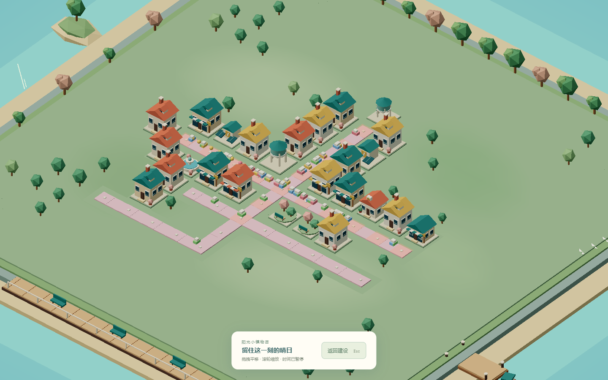
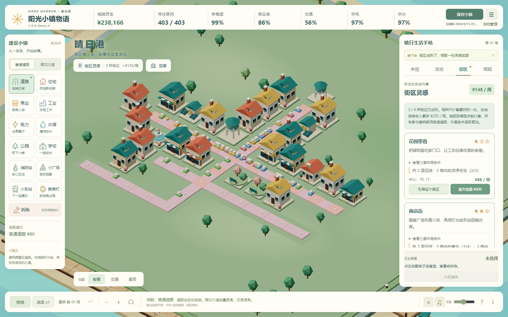

# 阳光小镇物语

在海风与樱花之间，规划一条街道、认识几位邻居，把居民的来信变成小镇的日常。一款中文桌面 3D 小镇经营游戏。

**街区灵感试玩版 · `1.0.0-demo.4.1` · 已发布试玩**

[试玩版本与下载](https://github.com/ZhongH1216/sunny-town-story/releases) · [开发源码](https://github.com/ZhongH1216/sunny-town-story/tree/main) · [反馈问题](https://github.com/ZhongH1216/sunny-town-story/issues)

**[下载 Windows 试玩 ZIP](https://github.com/ZhongH1216/sunny-town-story/releases/download/v1.0.0-demo.4.1/sunny-town-story-1.0.0-demo.4.1.zip)** · [版本说明与 SHA-256](https://github.com/ZhongH1216/sunny-town-story/releases/tag/v1.0.0-demo.4.1)。完整解压后双击 `start-sunny-town.bat`，需要 Python 3.10+；玩家无需 Node.js / npm。源码运行方法见[开发指南](docs/DEVELOPMENT.md)。

## 让摆放的位置有意义

demo.4 加入「街区灵感」：公园靠近住宅、商店围绕广场、学校连起生活圈、工坊远离住宅。不同位置会形成不同组合，继续建设也可能打破原有星级。

| 街区 | 从这里开始 | 继续完善 |
| --- | --- | --- |
| 花园里巷 | 公园 3 格内有 2 座住宅，中心与住宅 3 格内无工业。 | 添住宅、另一座公园和广场。 |
| 商店街 | 广场 3 格内有 2 间商业，广场 2 格内无工业。 | 添商业、住宅，再接入祭典灯或车站。 |
| 书香街坊 | 学校 4 格内有 2 座住宅，中心与住宅 3 格内无工业。 | 把更多住宅、公园和广场连进生活圈。 |
| 匠人街区 | 工坊 3 格内有商业，工坊距所有住宅至少 4 格。 | 邻近另一间隔离工坊，再补消防与车站。 |

格距按横竖步数计算，参与建筑都须接通道路。每种主题只结算最好的一处，1 / 2 / 3 星分别带来 **¥35 / ¥55 / ¥75 游客收入每周**，**全城最多 ¥250 / 周**。每种主题可领取一次 **¥600** 灵感奖励；重建或拆除不会重置领取记录。

「街区」页可免费选择布局引导，不扣费、不锁定建设。完整三星条件可展开查看；鼠标悬浮建造位置时，预览会提示组合星级与游客收入的变化。

## 来小镇住一阵

- **从三段故事开始**：晴日港补齐老街服务，花见町营造花园生活，日和街经营商店街，各有不同布局、资金和目标。
- **读来信，也做选择**：完成 9 封居民委托，在 4 份市政提案中决定预算与发展方向，筹备春日祭典后继续自由建设。
- **让街坊生活延续四季**：四季活动各有 2 个方案；用口碑解锁 3 个永久社区项目，收集 4 件纪念品，首次集齐获得 ¥5,000 纪念基金。
- **看见自己的规划**：借鉴 ISLANDERS 的空间组合思路与低多边形视觉方向，用本项目原创程序几何重新塑造海岛、建筑与树木。按 `P` 隐藏建设界面，看看刚刚完成的小镇。

看看街区灵感与布局引导

## 开始试玩

需要 **Python 3.10+**、支持 **WebGL 2 的桌面浏览器**和键盘鼠标。本版以 Windows、16:9 桌面屏幕为主要运行环境，不提供移动端适配。

1. 从上方下载链接或版本列表下载 ZIP，**完整解压**到一个文件夹。
2. 安装好 Python 后，双击 `start-sunny-town.bat`（或 `启动阳光小镇.bat`）。
3. 浏览器打开 `http://127.0.0.1:8765/`，选择故事，开始旅程。
4. 游玩时保留服务器窗口；结束时在该窗口按 `Ctrl+C`，或运行 `stop-sunny-town.bat`。

试玩包包含游戏依赖与素材，玩家无需安装 Node.js、npm 或 Conda；Python 运行时需自行安装。准备好运行环境后，游玩无需联网。GitHub 自动生成的源码压缩包需要另行安装开发依赖。

macOS / Linux 可尝试在解压目录运行 `python3 app.py`，但尚未完成实机验收。启动排障见[试玩说明](docs/DEMO_RELEASE_NOTES.md#启动排障与反馈)。

## 常用操作

| 想做什么 | 操作 |
| --- | --- |
| 建造 | 选左侧工具，点击地图；悬浮预览查看造价、街区组合影响和失败原因。 |
| 移动 / 缩放视角 | 鼠标拖拽 / 滚轮；`C` 回到中心。 |
| 连续铺路 | 道路工具下按住 `Shift` 拖拽。 |
| 暂停 / 调速 | 空格 / `V`，也可使用底部按钮。 |
| 观景 | `P` 进入，`P` 或 `Esc` 返回；观景期间暂停，退出恢复进入前的暂停状态。 |
| 撤销本周建造 | `U` 或 `Ctrl+Z`；周结算后清空，不倒回已结算收入。 |
| 检查城市 / 查看帮助 | 切换「交通」「服务」图层；底部 `?` 与 `i` 打开帮助。 |

右侧「来信 / 活动 / 街区 / 周报」记录进展；不知道接着做什么时，可点「接下来」。

## 保存小镇，按设备调整画面

游戏自动保存在当前浏览器，也可手动保存。**开启新故事、清理浏览器数据或更换设备前，请在「存档管理」导出 JSON 备份。** 继续游戏需使用同一浏览器、地址和端口。支持旧 v1 / v2 / v3 存档；街区奖励与引导写入独立的可选字段，缺少该字段的旧档可继续使用。

新玩家默认 **30 帧标准档**；「存档管理 → 画面与耗电」可选 24 帧省电档或 60 帧流畅档。已有存档里的有效画面偏好继续保留。暂停、菜单降帧，切到后台后停止绘制、模拟和音乐；实际帧率取决于设备和城镇规模。

本轮合并低多边形静态细节、道路和移动体的绘制，减少零散网格提交；测量方法、对照结果及限制见[性能报告](docs/PERFORMANCE.md)。图形连接中断时会暂停并提供恢复、备份与保存刷新入口。

## 试玩范围与验证

地图固定为 **18 × 18**，运行时场景使用 Three.js 程序几何与顶点颜色，音乐和音效使用 WebAudio。旧 PNG 仅保留为历史素材生产源，已不再预加载到新场景。本版没有地图扩张、随机地图、多人联机或原生安装器。

2026-09-16，demo.4.1 的 **84 项云端 Playwright 回归全部通过（69 项浏览器回归 + 15 项街区纯计算）**，另有 **3 项美术几何与资源测试、9 项服务与启动代理测试通过**。实际 ZIP 解压后 78 个文件校验通过，正常入口启程、保存与读档正常，没有页面异常或资源加载失败。公开附件已重新下载并核对 SHA-256。[发布验证记录](docs/RELEASE_VERIFICATION.md)包含对应任务和校验值。三个故事均使用正常经营收入完成祭典，没有额外注资。

本轮浏览器验收显式使用 SwiftShader 软件渲染，本机默认 ANGLE 曾出现 SharedImage 创建失败。游戏不强制软件渲染，软件后端通过不代表硬件兼容问题已解决，也不等于所有电脑能达到相同帧率。完整记录与正常经济结果见[发布说明](docs/DEMO_RELEASE_NOTES.md)。

## 开发与反馈

[开发指南](docs/DEVELOPMENT.md) · [参与贡献](CONTRIBUTING.md) · [更新日志](CHANGELOG.md)。

欢迎在 [GitHub Issues](https://github.com/ZhongH1216/sunny-town-story/issues) 反馈难度、节奏或问题。请附上版本、浏览器、小镇周数和复现步骤；画面问题可附截图，经营或存档问题可附导出的 JSON。

项目采用 [MIT 许可证](LICENSE)。
