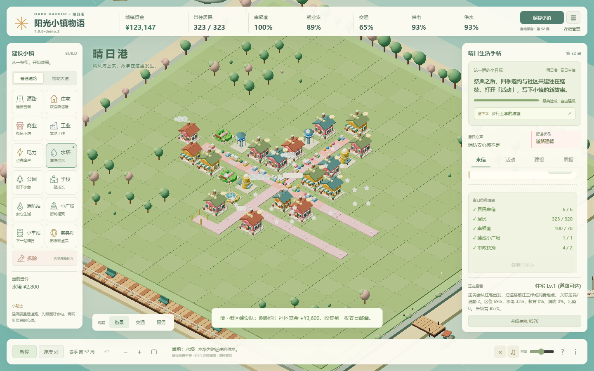
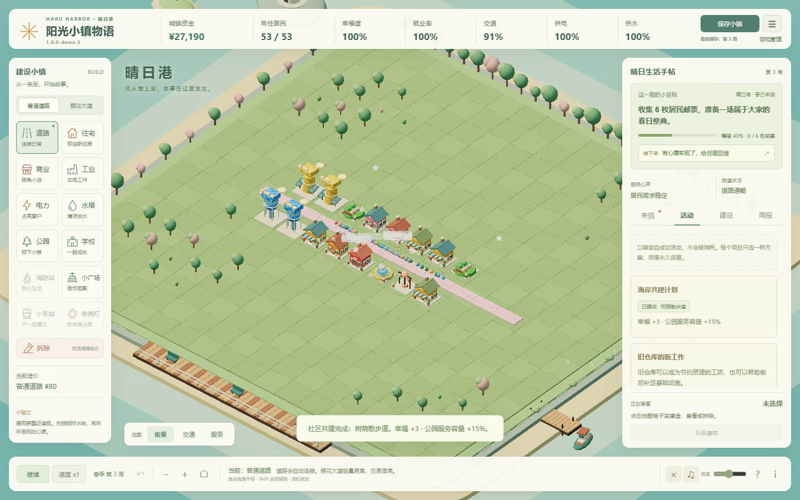

# 阳光小镇物语

在海风与樱花之间，规划一条街道、认识几位邻居，把居民的来信变成小镇的日常。一款中文桌面 3D 小镇经营游戏。

**春日试玩版 · `1.0.0-demo.3` · 预发布**

[下载试玩 ZIP](https://github.com/ZhongH1216/sunny-town-story/releases/download/v1.0.0-demo.3/sunny-town-story-1.0.0-demo.3.zip) · [版本发布页](https://github.com/ZhongH1216/sunny-town-story/releases/tag/v1.0.0-demo.3) · [GitHub 仓库](https://github.com/ZhongH1216/sunny-town-story) · [反馈问题](https://github.com/ZhongH1216/sunny-town-story/issues)

## 来小镇住一阵

- **从三段故事开始**：晴日港补齐老街的日常服务，花见町营造花园生活，日和街经营热闹商店街。三种开局有不同布局、资金和目标。
- **读来信，也做选择**：完成 9 封居民委托，亲手回信领取邮票；在 4 份市政提案中决定预算与发展方向。
- **准备一场春日祭典**：收集 6 枚邮票、完成故事清单，邀请邻居一起庆祝。祭典之后仍可继续建设。
- **让街坊生活延续四季**：每季 12 个模拟周，野餐、晚集、手作和灯光活动各有 2 个方案。自愿接受后，在 6 周内累计 2 或 3 周达标，领取奖励与口碑。
- **留下自己的小镇记忆**：口碑解锁 3 个永久社区项目，每项二选一；收集 4 件四季纪念品，首次集齐获得 ¥5,000 纪念基金。
- **建设有真实取舍**：规划道路、水电与公共服务，平衡就业、污染和通勤；用图层、来信和周报看懂城镇需要什么。

看看街坊活动与社区项目

## 开始试玩

需要 **Python 3.10+**、支持 **WebGL 2 的桌面浏览器**和键盘鼠标。本版以 Windows、16:9 桌面屏幕为主要运行环境，不提供移动端适配。

1. 从上方下载试玩 ZIP，**完整解压**到一个文件夹。
2. 安装好 Python 后，双击 `start-sunny-town.bat`（或 `启动阳光小镇.bat`）。
3. 浏览器打开 `http://127.0.0.1:8765/`，选择故事，开始旅程。
4. 游玩时保留服务器窗口；结束时在该窗口按 `Ctrl+C`，或运行 `stop-sunny-town.bat`。

试玩包已包含游戏依赖与素材，玩家无需安装 Node.js、npm 或 Conda；Python 运行时需自行安装。准备好运行环境后，游玩无需联网。请下载上方的**试玩 ZIP**，GitHub 自动生成的源码压缩包需要另行安装开发依赖。

macOS / Linux 可尝试在解压目录运行 `python3 app.py`，但尚未完成实机验收。启动排障见[试玩说明](docs/DEMO_RELEASE_NOTES.md#启动排障与反馈)。

## 常用操作

| 想做什么 | 操作 |
| --- | --- |
| 建造 | 选左侧工具，点击地图；悬浮预览显示造价和失败原因。 |
| 移动 / 缩放视角 | 鼠标拖拽 / 滚轮；`C` 回到中心。 |
| 连续铺路 | 道路工具下按住 `Shift` 拖拽。 |
| 暂停 / 调速 | 空格 / `V`，也可使用底部按钮。 |
| 撤销本周建造 | `U` 或 `Ctrl+Z`；周结算后清空，不倒回已结算收入。 |
| 检查城市 / 查看帮助 | 切换「交通」「服务」图层；底部 `?` 与 `i` 打开帮助。 |

右侧「来信 / 活动 / 建设 / 周报」记录当前进展；不知道接着做什么时，可点「接下来」。

## 保存小镇，按设备调整画面

游戏自动保存在当前浏览器，也可手动保存。**开启新故事、清理浏览器数据或更换设备前，请在「存档管理」导出 JSON 备份。** 继续游戏需使用同一浏览器、地址和端口。导入支持旧 v1 / v2 / v3 存档。

「存档管理 → 画面与耗电」默认 **24 帧省电档**，可选 30 / 60 帧。暂停时上限 10 帧，菜单与阻塞弹层为 1 帧；切到后台后停止绘制、模拟和音乐。实际帧率取决于设备和城镇规模。

图形连接中断时会暂停游戏，并提供恢复画面、导出备份和保存后刷新的入口。若反复出现，请先保留存档，并附上浏览器与设备信息反馈。

## 试玩范围与验证

地图固定为 **18 × 18**，使用 Three.js 程序几何与 PNG 贴图、WebAudio 音乐和音效。本版没有地图扩张、随机地图、多人联机或原生安装器。

2026-09-13 验收：**62 / 62 项浏览器回归、2 / 2 项服务及启动代理测试通过**；干净源码安装、环境检查与实际 ZIP 解压验证通过，全部文件哈希一致，普通入口启程、存档和场景显示正常，验证中没有页面异常或资源加载失败。三种故事均使用正常经营收入完成祭典，没有额外注资。

本机 Chromium 默认 ANGLE 后端出现 SharedImage 创建失败，本轮自动化显式使用 **SwiftShader 软件渲染**。交付游戏不强制软件渲染；测试通过不能证明默认硬件后端问题已解决，也不代表所有设备或长期游玩均无问题。完整结果与限制见[发布说明](docs/DEMO_RELEASE_NOTES.md)。

## 开发与反馈

开发使用 Python、Node.js / npm 和 Playwright：[开发指南](docs/DEVELOPMENT.md) · [参与贡献](CONTRIBUTING.md) · [更新日志](CHANGELOG.md)。

欢迎在 [GitHub Issues](https://github.com/ZhongH1216/sunny-town-story/issues) 反馈难度、节奏或问题。请附上版本、浏览器、小镇周数和复现步骤；画面问题可附截图，经营或存档问题可附导出的 JSON。

项目采用 [MIT 许可证](LICENSE)。
